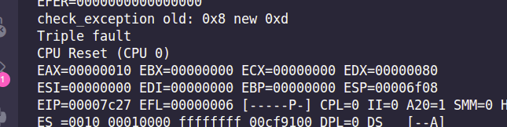
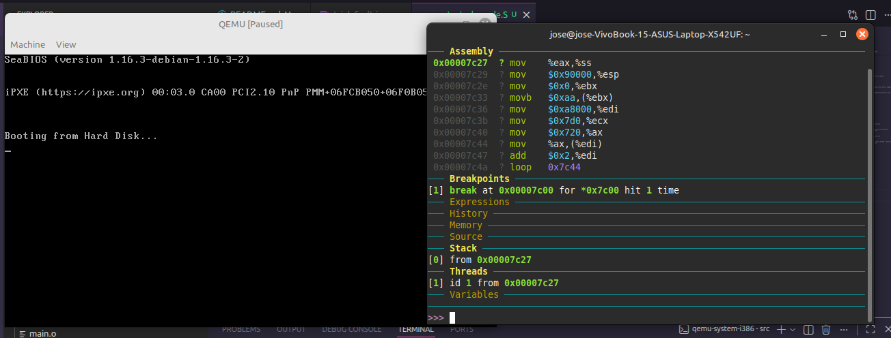
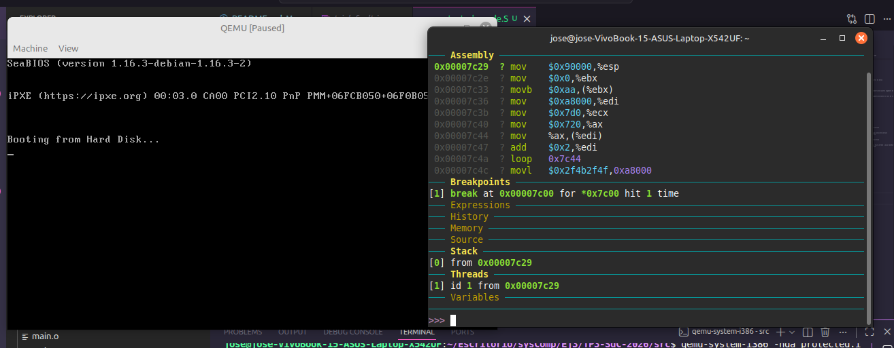
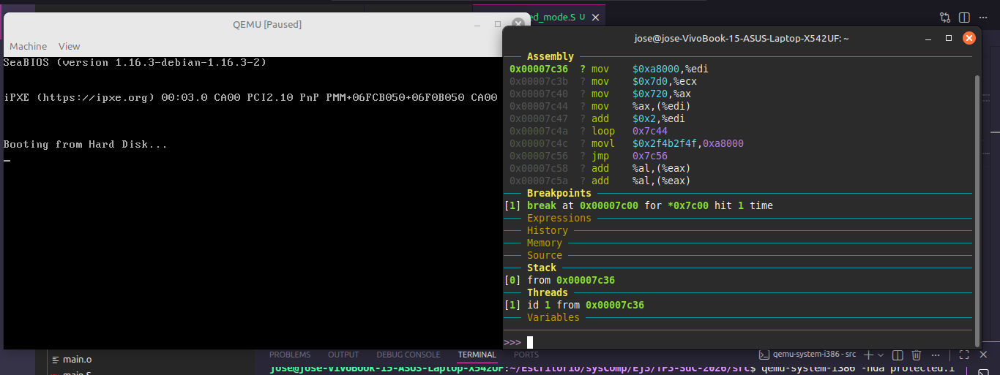
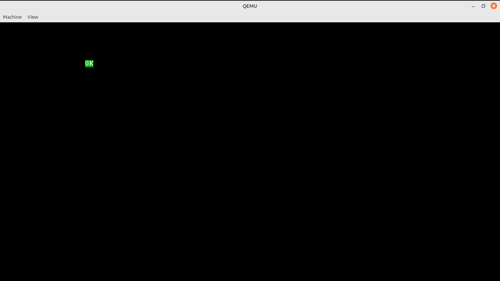

# TP3 - Sistemas de Computación 2026  
## FCEFyN

### Integrantes
- José María Galoppo  
- Julián Moreyra  
- Pablo Díaz

### Repositorios

[Repositorio Moreyra](https://github.com/moreyrajulian/TP3-SdC-2026)

[Repositorio Galoppo](https://github.com/JoseMGaloppo/TP3-SdC-2026)

---

# 1. Introducción General

Este trabajo presenta la implementación de un sistema de arranque y transición de arquitectura desarrollado para la asignatura Sistemas de Computación (2026). El objetivo principal es comprender en profundidad el proceso de inicialización de una computadora desde sus niveles más básicos, trabajando en un entorno bare-metal sobre arquitectura x86.

A lo largo del proyecto se desarrollan distintos componentes clave del proceso de arranque, comenzando desde un MBR mínimo funcional hasta la transición al Modo Protegido, configurando manualmente estructuras fundamentales como la Tabla Global de Descriptores (GDT). Todo el desarrollo se realiza sin la intervención de un sistema operativo, permitiendo interactuar directamente con el hardware y observar el comportamiento real del procesador.

Además, se emplean herramientas como QEMU y GDB para la emulación y depuración del sistema, lo que facilita el análisis detallado del flujo de ejecución, la gestión de memoria y los mecanismos de protección implementados por la arquitectura. Este enfoque permite no solo validar el funcionamiento del código, sino también comprender los errores y excepciones que surgen durante la ejecución, como el caso del triple fault.

El resultado es una aproximación práctica y detallada al funcionamiento interno del proceso de arranque en sistemas x86, integrando conceptos teóricos con su implementación directa a bajo nivel.

# 2. Organización de los Repositorios

El presente archivo README se encuentra replicado en cada uno de los repositorios asociados al trabajo práctico.  

Si bien la estructura general del documento se mantiene constante, es posible encontrar variaciones en:

- Ejemplos de código
- Scripts de compilación
- Casos de prueba específicos

Esto permite experimentar con distintas configuraciones manteniendo una base conceptual común.


# 3. Implementación Inicial del MBR

## 3.1 MBR mínimo funcional

En una primera etapa se desarrolló un **MBR mínimo funcional** utilizando la función `printf`.  

Este enfoque permitió generar una imagen binaria básica capaz de ser interpretada por el emulador **QEMU**, facilitando la validación inicial del entorno de ejecución.


# 4. Desarrollo en Lenguaje Ensamblador

En una segunda etapa se implementó un MBR más avanzado mediante **lenguaje ensamblador en modo real (16 bits)**.


## 4.1 Uso de la Interrupción 0x10

Se utilizó la interrupción:

`0x10`

correspondiente a los **servicios de video de la BIOS**, específicamente en modo texto.

Esto permitió la impresión directa de caracteres en pantalla sin depender de un sistema operativo.


## 4.2 Código Fuente del MBR

```asm
.code16
.global _start

_start:
    mov $msg, %si
    mov $0x0e, %ah

print_loop:
    lodsb
    or %al, %al
    jz halt
    int $0x10
    jmp print_loop

halt:
    hlt
    jmp halt

msg:
    .ascii "FFFFF  CCCCC  EEEEE  FFFFF  Y   Y  N   N\r\n"
    .ascii "F      C      E      F       Y Y   NN  N\r\n"
    .ascii "FFFF   C      EEEE   FFFF     Y    N N N\r\n"
    .ascii "F      C      E      F        Y    N  NN\r\n"
    .ascii "F      CCCCC  EEEEE  F        Y    N   N\r\n"
    .byte 0
```


## 4.3 Análisis del Código Ensamblador

Durante la inicialización:

- Se establece el registro `SI` apuntando al mensaje (`msg`)
- Se configura el registro `AH` con el valor `0x0E`, correspondiente a la función de teletipo de la BIOS

Esto permite preparar el entorno para imprimir caracteres en pantalla.

El bucle principal realiza las siguientes operaciones:

- `lodsb`  
  Carga un byte desde la dirección apuntada por `SI` en `AL`, incrementando automáticamente `SI`.

- `or %al, %al`  
  Permite verificar si el byte leído es nulo (fin de cadena).

- `jz halt`  
  Si se detecta el final del mensaje, se transfiere el control al estado de detención.

- `int $0x10`  
  Invoca la interrupción BIOS para imprimir el carácter almacenado en `AL`.

El ciclo continúa hasta encontrar el byte nulo final.

Cuando se alcanza el final del mensaje:

- `hlt` detiene la CPU
- Se ejecuta un bucle infinito para evitar comportamiento indefinido


## 4.4 Depuración y Análisis con GDB

Además del desarrollo del código en ensamblador, se llevó a cabo un proceso de depuración y análisis detallado utilizando **GDB** (GNU Debugger), lo que permitió observar el comportamiento del sistema durante las primeras etapas del arranque.

Para facilitar la depuración remota, se ejecutó el emulador QEMU con las siguientes opciones:
`qemu-system-i386 -fda main.img -boot a -s -S -monitor stdio`

Donde:

* `-s` habilita un servidor GDB en el puerto 1234.
* `-S` detiene la ejecución de la CPU al inicio, permitiendo la conexión del depurador antes de ejecutar instrucciones.
* `-monitor stdio` habilita la consola de monitoreo de QEMU en la terminal.

Una vez iniciado QEMU, se establece la conexión desde GDB al puerto habilitado:
`target remote localhost:1234`

Esto permite inspeccionar el estado de la CPU, incluyendo registros, memoria y flujo de ejecución, desde el primer instante del bootloader.

A continuación, se muestran capturas del proceso de depuración:


# 5. Comparación entre objdump y hd

Se realizó una comparación entre:

- `objdump`
- `hd` (hexdump)

Ubicación de la firma:


Ubicación de código en objdump y hd:


# 6. Modo protegido

Para realizar la transición a Modo Protegido sin utilizar macros, se desarrolló un código en lenguaje ensamblador que configura las estructuras de protección de memoria directamente a nivel de hardware.

Para cumplir con la consigna de poseer espacios de memoria diferenciados, se construyó manualmente la Tabla Global de Descriptores (GDT), definiendo explícitamente los bytes de cada entrada:

- **Descriptor Nulo**: Requisito arquitectónico (8 bytes en cero).

- **Segmento de Código** (Selector 0x08): Se configuró con dirección base 0x00000000, límite 0xFFFFF y permisos de ejecución/lectura.

- **Segmento de Datos** (Selector 0x10): Para diferenciar su espacio, se le asignó una dirección base distinta: 0x00010000 (modificando el cuarto byte del descriptor a 0x01).

El código se encuentra en src/protected_mode.S


## Transición a Modo Protegido

El flujo principal del código realiza los pasos clásicos para cambiar desde Modo Real (16 bits) a Modo Protegido (32 bits):

1. Deshabilitación de interrupciones (cli)  
Se evita que ocurra cualquier interrupción durante la transición, ya que el sistema aún no tiene configurada una IDT válida.

2. Carga de la GDT (lgdt)  
Se carga el registro GDTR con la dirección base y el tamaño de la GDT definida.

3. Habilitación de la línea A20  
Se activa la línea A20 mediante el puerto 0x92, permitiendo acceder a memoria por encima de 1 MB.

4. Activación del bit PE en CR0  
Se modifica el registro de control CR0 seteando el bit 0 (Protection Enable), lo que habilita el Modo Protegido.

5. Salto largo (ljmp)  
Se realiza un salto lejano al selector de código (0x08), lo que:
- Limpia el pipeline de ejecución
- Carga correctamente el registro CS
- Completa la transición a modo protegido


## Inicialización en Modo Protegido

Una vez en .code32, se configuran los registros de segmento:

- Todos los segmentos de datos (ds, es, fs, gs, ss) se cargan con el selector 0x10.
- Se inicializa el stack apuntando a la dirección 0x90000, dentro del espacio definido por el segmento de datos.


## Caso 1: Violación de memoria (Segmento de solo lectura)

Para comprobar la protección de memoria, se modificaron los bits de acceso del Segmento de Datos, configurándolo explícitamente como de solo lectura.

En el código se incluye la siguiente instrucción de prueba:

```asm
movl $0x00000000, %ebx
movb $0xAA, (%ebx)
```

Esta operación intenta escribir en memoria para forzar una violación de permisos.

Pero es curioso ya que el fallo ocurre incluso antes de esta instrucción. Al intentar cargar el registro de pila (%ss) con un selector que apunta a un descriptor de solo lectura, el procesador detecta una configuración inválida y genera una excepción.


### ¿Qué debería suceder a continuación?

Dado que el programa se ejecuta en un entorno bare-metal sin una IDT configurada, la excepción no puede ser manejada.

Esto genera una cadena de fallos:

1. Excepción inicial (protección de segmento)  
2. Falla al intentar manejarla (ausencia de IDT)  
3. Triple Fault  

La consecuencia arquitectónica es un reinicio del procesador.

Se depuró el código paso a paso verificando este comportamiento:


Al avanzar en la depuración, se observó que el Program Counter salta a una dirección desconocida:


Con el log de QEMU confirmamos el reinicio:




## Caso 2: Ejecución correcta (Segmento de lectura/escritura)

Cuando el descriptor de datos se configura correctamente con permisos de lectura/escritura (0b10010010), el sistema funciona sin errores.

La instrucción de prueba:

```asm
movb $0xAA, (%ebx)
```

se ejecuta correctamente, ya que el segmento permite operaciones de escritura.






## Prueba extra: Visualización inicial en pantalla

## Limpieza de pantalla

Dado que la memoria de video conserva información previa, antes de mostrar un "OK" en modo protegido se ejecuta una rutina para limpiar la pantalla:

```asm
movl $0xA8000, %edi
movl $80*25, %ecx
movw $0x0720, %ax

clear_screen:
    movw %ax, (%edi)
    addl $2, %edi
    loop clear_screen
```

### Explicación

- 0xA8000: Dirección base de la memoria de video en modo texto.  
- Cada celda ocupa 2 bytes:
  - 1 byte: carácter ASCII  
  - 1 byte: atributo (color)  

- 0x0720:
  - 0x20 → carácter espacio  
  - 0x07 → atributo (gris claro sobre negro pero no se verá ya que se carga caracter "espacio")  

- Bucle loop:
  - Itera 80 × 25 = 2000 posiciones (toda la pantalla)
  - En cada iteración:
    - Escribe un espacio en pantalla
    - Avanza 2 bytes en memoria

El resultado es una pantalla completamente limpia.


## Estado final del sistema

- En el caso incorrecto → Triple Fault y reinicio  
- En el caso correcto →  
  - Se escribe en memoria sin errores  
  - Se limpia la pantalla correctamente  
  - Se muestra "OK" en pantalla  
  - El sistema queda ejecutando en un bucle infinito (jmp .) en Modo Protegido  



Esto demuestra tanto el correcto funcionamiento de la transición a Modo Protegido como la efectividad del mecanismo de protección de memoria implementado mediante la GDT.

# 7. Apartado de respuestas

**¿Qué es UEFI? ¿como puedo usarlo? Mencionar además una función a la que podría llamar usando esa dinámica**

UEFI (Unified Extensible Firmware Interface) es el reemplazo moderno de la BIOS tradicional. A diferencia de la BIOS (que es un entorno primitivo de 16 bits), UEFI corre en 32 o 64 bits, tiene su propio gestor de arranque, soporta particiones gigantes (GPT) e incluso red nativa.

En lugar de usar primitivas interrupciones de hardware, UEFI expone una API programable en C. Se compilan aplicaciones que interactúan con el firmware a través de tablas de punteros a funciones. El entorno se divide en dos grandes grupos: Boot Services (servicios disponibles solo mientras la PC está arrancando) y Runtime Services (servicios que siguen disponibles incluso después de que tu sistema operativo cargó).

Usando esa dinámica de API en C, se podría llamar a la función AllocatePages() (de los Boot Services) para reservar bloques de memoria física directamente, o a GetTime() (de los Runtime Services) para consultar el reloj de hardware (RTC).

**¿Menciona casos de bugs de UEFI que puedan ser explotados?**

Como UEFI es tan complejo y tiene millones de líneas de código, su superficie de ataque es enorme. Algunos casos famosos y graves:

- **LogoFAIL (2023)**: Un conjunto de vulnerabilidades en los parsers de imágenes del firmware. Los atacantes podían inyectar código malicioso simplemente modificando el logo de la marca (ej. Lenovo, Acer) que se muestra en pantalla durante el arranque, logrando ejecución de código antes de que los mecanismos de seguridad del SO se activen.

- **BootHole (CVE-2020-10713)**: Una vulnerabilidad en el gestor de arranque GRUB2 que permitía evadir el Secure Boot de UEFI, dejando que un atacante instalara bootkits persistentes e invisibles para el sistema operativo.

- **BlackLotus (2022/2023)**: Uno de los primeros bootkits de UEFI detectados en estado salvaje que lograba evadir Secure Boot, desactivar herramientas de seguridad como BitLocker o Microsoft Defender y establecer persistencia a nivel de firmware.

**¿Qué es Converged Security and Management Engine (CSME), the Intel Management Engine BIOS Extension (Intel MEBx)?**

- **CSME (Converged Security and Management Engine)**: Anteriormente conocido como Intel ME (Management Engine). Es literalmente una "computadora dentro de una computadora". Es un microcontrolador autónomo integrado directamente en los chipsets de Intel. Funciona de forma completamente independiente a la CPU principal y al sistema operativo; tiene acceso total a la memoria, red y periféricos, y se mantiene encendido y operando incluso si la PC está apagada.

- **Intel MEBx (Management Engine BIOS Extension)**: Es la interfaz de configuración a nivel de firmware. Le permite a un administrador configurar los parámetros del CSME, como por ejemplo la tecnología Intel vPro / AMT (Active Management Technology), que sirve para administrar, reparar y monitorear equipos de forma remota a nivel corporativo, "fuera de banda" (out-of-band).

**¿Qué es coreboot ? ¿Qué productos lo incorporan ?¿Cuales son las ventajas de su utilización?**

Coreboot es un proyecto de firmware de código abierto diseñado para reemplazar la BIOS/UEFI privativa de los fabricantes. Su filosofía principal es hacer la inicialización del hardware más rápida y mínima posible (configurar la RAM, inicializar la CPU básica) y delegar inmediatamente el control a un Payload (que puede ser SeaBIOS para emular una BIOS vieja, TianoCore para emular UEFI, o directamente arrancar un kernel de Linux desde la misma memoria flash).

- Todas las Chromebooks de Google utilizan Coreboot como su firmware base.

- Laptops enfocadas en Linux y privacidad, como las ensambladas por System76 o los equipos Librem de Purism.

- Equipos de red corporativos e infraestructura de servidores donde se requiere auditoría estricta del firmware.

**Ventajas de su utilización**

- **Velocidad  de arranque**: Al eliminar todo el código innecesario que los fabricantes le meten a las UEFI comerciales, el hardware se inicializa en milisegundos.

- **Seguridad**: Al ser de código abierto, cualquier desarrollador puede auditar el código fuente en busca de puertas traseras o vulnerabilidades (reduciendo la superficie de ataque).

- **Soberanía de hardware**: Le devuelve al usuario el control real sobre lo que se ejecuta en los anillos de mayor privilegio del procesador (Ring -2 / Ring -3), evitando depender de "cajas negras" de código cerrado.

**¿Que es un linker? ¿que hace?** 

El linker es un programa del sistema que toma uno o más archivos objeto (los archivos .o generados por el ensamblador o el compilador) y los combina para crear un único archivo ejecutable.

Sus dos tareas principales son:

- **Resolución de símbolos**: Conecta las referencias a etiquetas, funciones o variables que pueden estar definidas en distintos archivos.

- **Reubicación**: Ajusta las direcciones de memoria relativas del código objeto y les asigna direcciones absolutas definitivas para que el programa sepa exactamente a dónde saltar o de dónde leer datos cuando se ejecute.

**¿Que es la dirección que aparece en el script del linker?¿Porqué es necesaria ?**

La dirección que aparece en el script (específicamente la directiva . = 0x7c00;) es la dirección física de memoria base donde el programa va a ser cargado.

Es necesaria porque por convención arquitectónica, la BIOS siempre carga el primer sector del disco booteable (el MBR) exactamente en la dirección de memoria física 0x7c00. Si no se le avisa al linker que el programa va a vivir ahí, el linker asumirá que arranca en la dirección 0x0. Como resultado, cuando el código intente hacer un salto o leer una variable, calculará mal el desplazamiento (offset) y saltará a una porción de memoria inválida, colgando el sistema.

**¿Para que se utiliza la opción --oformat binary en el linker?**

En un entorno de desarrollo estándar, el linker genera archivos ejecutables con formatos específicos para sistemas operativos (como el formato ELF en Linux o PE en Windows). Estos formatos incluyen "cabeceras" y metadatos que le dicen al SO cómo cargar el programa.
Como en este TP se está programando bare-metal (sin sistema operativo), no hay nadie que entienda esas cabeceras. La opción --oformat binary le indica al linker que elimine todos los metadatos y genere un binario plano (flat binary): puro código máquina crudo que la CPU ejecutará ciegamente instrucción por instrucción.

**¿Cómo sería un programa que tenga dos descriptores de memoria diferentes, uno para cada segmento (código y datos) en espacios de memoria diferenciados?**

Un programa con estas características sería aquel que implementa un esquema de segmentación no lineal. Para lograrlo, el programa debe definir una estructura de datos en la memoria llamada GDT (Global Descriptor Table), donde los registros de base de cada descriptor apunten a direcciones físicas distintas.

Sería un programa donde una misma dirección lógica (por ejemplo, la dirección 0x05) se traduce a dos lugares físicos distintos en la memoria RAM dependiendo de si el procesador está intentando leer una instrucción para ejecutarla o un dato para operarlo. Esto permite un aislamiento total, donde el código no puede "ver" ni modificar accidentalmente sus propios datos si se encuentran en segmentos con bases y permisos diferenciados.

**En modo protegido, ¿Con qué valor se cargan los registros de segmento ? ¿Porque?** 

En Modo Protegido, los registros de segmento (CS, DS, ES, SS, etc.) ya no se cargan con direcciones de memoria física base. En su lugar, se cargan con un valor llamado Selector de Segmento (por ejemplo, `$0x08 ` o `$0x10`).

La razón es que este selector funciona como un índice. Un selector señala a un descriptor de segmento específico dentro de la GDT. El procesador utiliza este valor para ubicar la entrada en la tabla y cargar automáticamente en sus registros caché invisibles la verdadera dirección Base de 32 bits, el Límite de 20 bits y los Atributos de seguridad del segmento.
