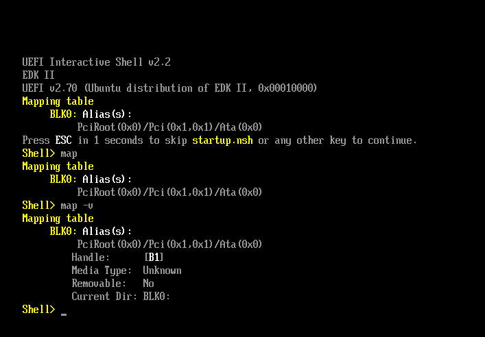
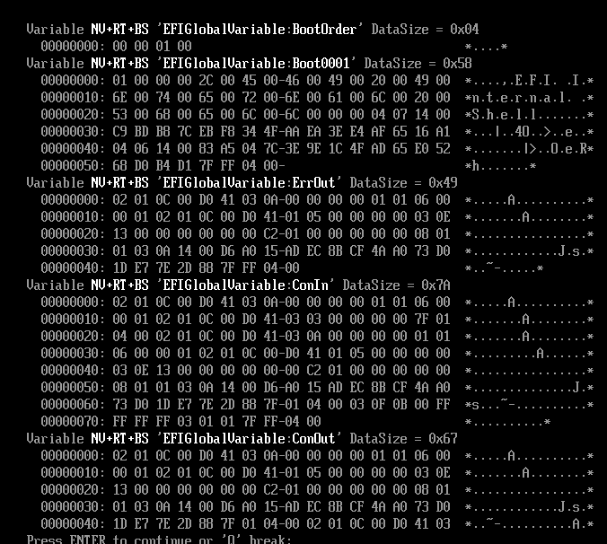
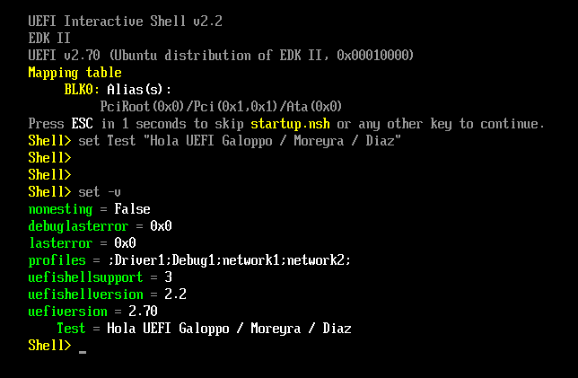
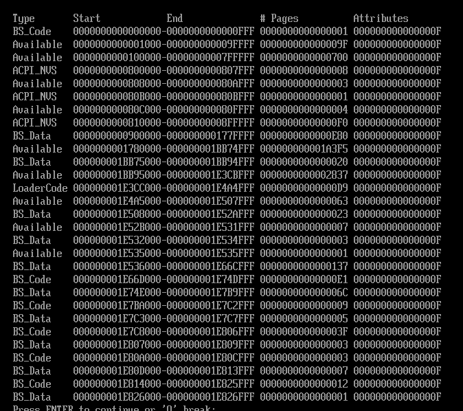
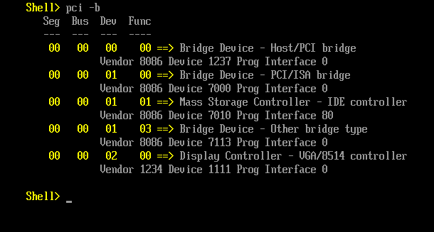

# TP3 - Sistemas de Computación 2026  
## FCEFyN

### Integrantes
- José María Galoppo  
- Julián Moreyra  
- Pablo Díaz

---

# 1. Introducción General

# 2. Organización de los Repositorios

El presente archivo `README` se encuentra replicado en cada uno de los repositorios asociados al trabajo práctico. En particular, en este documento se explica una extensión del TP3 dedicada exclusivamente a la interfaz UEFI.

Si bien la estructura general de la documentación se mantiene constante, es posible encontrar variaciones en:

- Ejemplos de código.
- Scripts de compilación.
- Casos de prueba específicos.

Esta modularidad permite experimentar con distintas configuraciones manteniendo una base conceptual común en todos los repositorios.

# 3. Exploración del entorno UEFI y la Shell

## 3.1 Arranque en el entorno virtual y exploración de Dispositivos (Handles y Protocolos)

*Figura 1: Captura de la shell de UEFI mostrando la inicialización del entorno y el mapeo de los dispositivos disponibles.*

**Pregunta de Razonamiento 1: Al ejecutar el comando `map` y `dh`, vemos protocolos e identificadores en lugar de puertos de hardware fijos. ¿Cuál es la ventaja de seguridad y compatibilidad de este modelo frente al antiguo BIOS?**

Este paradigma provee una abstracción total del hardware subyacente. Permite utilizar el mismo firmware UEFI para interactuar con arquitecturas y dispositivos de hardware sumamente diversos (discos, memoria, E/S) mediante interfaces estandarizadas (protocolos), en lugar de depender de interrupciones o puertos fijos. Desde una perspectiva de seguridad, esto garantiza un acceso mucho más controlado y estructurado al hardware, mitigando errores críticos y accesos arbitrarios peligrosos. Sin embargo, al ser UEFI una especificación mucho más robusta y compleja, la superficie de ataque potencial se ve lógicamente ampliada.

## 3.2 Análisis de Variables Globales (NVRAM)

**Pregunta de Razonamiento 2: Observando las variables `Boot####` y `BootOrder`, ¿cómo determina el Boot Manager la secuencia de arranque?**

La prioridad de arranque queda estrictamente definida por el arreglo de identificadores almacenado en la variable `BootOrder` dentro de la NVRAM. El *Boot Device Selector* (BDS) lee esta secuencia y procede a buscar la entrada `Boot####` correspondiente (por ejemplo, `Boot0001`). Finalmente, el firmware lee la ruta contenida en dicha variable, la cual apunta directamente a la ubicación del ejecutable EFI (`.efi`) en la partición del sistema, iniciando así su carga y ejecución.

*Figura 2: Salida del comando `dmpstore`, detallando el volcado de las variables de entorno almacenadas en la NVRAM.*

*Figura 3: Ejecución y manipulación de variables en la shell, evidenciando cómo se gestionan los parámetros de configuración del sistema.*

## 3.3 Footprinting de Memoria y Hardware

*Figura 4: Mapa de memoria (`memmap`) reportado por UEFI, donde se describen las distintas regiones físicas, su tipo y los atributos de acceso asignados.*

**Pregunta de Razonamiento 3: En el mapa de memoria (`memmap`), existen regiones marcadas como `RuntimeServicesCode`. ¿Por qué estas áreas son un objetivo principal para los desarrolladores de malware (Bootkits)?**

Estas regiones son críticas porque alojan servicios que persisten en memoria incluso después de que el sistema operativo toma el control (*ExitBootServices*). Al ejecutarse a nivel de firmware y con los máximos privilegios de la arquitectura, representan un vector ideal para la persistencia. Un atacante que logre inyectar código allí podría instalar *hooks* en las llamadas del firmware, alterar variables críticas (como desactivar `SecureBoot` o modificar `BootOrder`), y manipular subrepticiamente el arranque o los mecanismos de seguridad del sistema operativo antes de que este inicie.

# 4. Desarrollo, compilación y análisis de seguridad